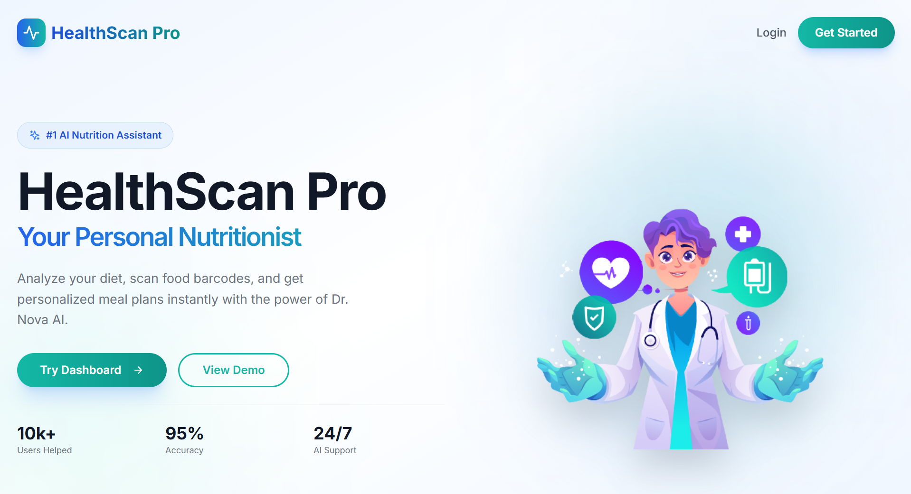
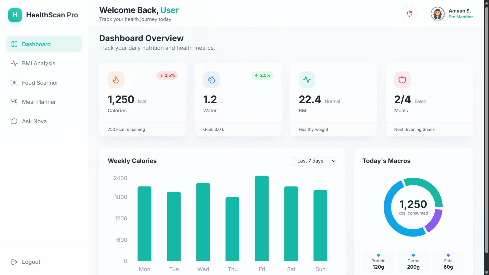
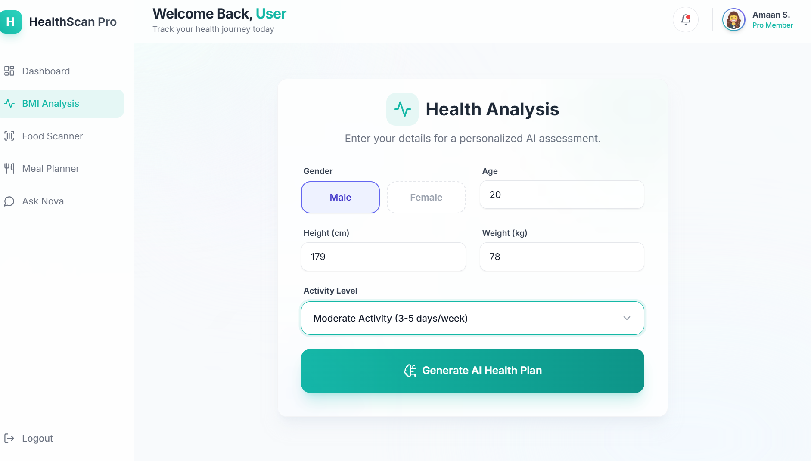
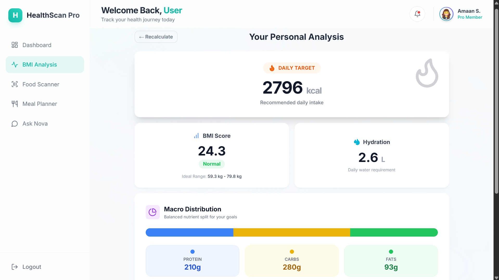
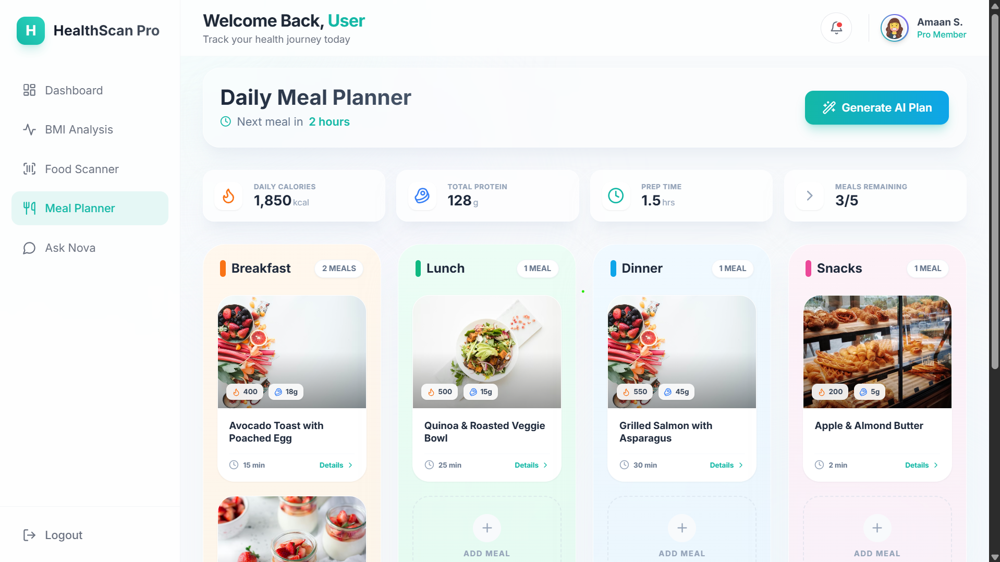
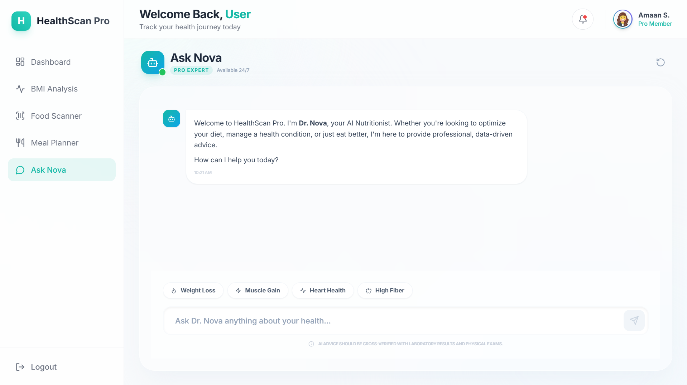

<<<<<<< HEAD
# 🏥 HealthScan Pro

**Your Personal AI-Powered Nutritionist & Health Companion**

HealthScan Pro is a cutting-edge web application designed to revolutionize how you track your nutrition. Combining real-time barcode scanning, deep health analysis, and AI-driven consultations, it's the only tool you need to master your diet and achieve your wellness goals.


---

## 🌟 Key Features

### 1. **Interactive Dashboard**
Get a high-level view of your daily health stats. Track calories, water intake, and macronutrient distribution through beautiful, animated glassmorphic widgets.


<!-- ### 2. **AI Food Scanner** -->
<!-- Instantly scan product barcodes. We fetch real-time data from global databases to provide you with NutriScores, allergen alerts, and detailed nutritional breakdowns.
 -->

### 2. **Professional BMI & Health Analysis**
Beyond just BMI. Get personalized advice based on your BMR, TDEE, and activity levels. Our AI analyzes your data to suggest optimal calorie and macronutrient splits.



### 4. **Weekly Meal Planner**
Organize your nutrition with a vibrant, intuitive planner. Add meals manually or generate AI plans, track calories per meal, and manage your entire week's diet in one place.


### 5. **Ask Nova (AI Nutritionist Doctor)**
Meet Dr. Nova—your 24/7 AI health consultant. Powered by Gemini Pro, Nova provides evidence-based medical-grade nutritional advice, remembers your conversation history, and helps you navigate complex health queries.


---

## 🚀 Tech Stack

- **Frontend**: React 18, Vite, TypeScript
- **Styling**: Tailwind CSS (Glassmorphism, Gradients)
- **Animations**: Framer Motion
- **AI Engine**: Google Gemini 1.5 (Generative AI)
- **Data Source**: OpenFoodFacts API
- **Icons**: Lucide React
- **Scanning**: @zxing/browser

---

## 🛠️ Getting Started

### Prerequisites
- Node.js (v18+)
- npm or yarn

### Installation

1. **Clone the project**
   ```bash
   git clone https://github.com/your-username/health-scan-pro.git
   cd health-scan-pro
   ```

2. **Backend Setup**
   ```bash
   cd server
   npm install
   node index.js
   ```

3. **Frontend Setup**
   ```bash
   cd client
   npm install
   npm run dev
   ```

4. **Environment Variables**
   Create a `.env` file in the client and server directories if you wish to use your own MongoDB or Gemini API keys.

---

## 📸 Screenshots

| Landing Page | Dashboard |
| :---: | :---: |
|  |  |

| Food Scanner | Meal Planner |
| :---: | :---: |
|  |  |

---

## 🛡️ Medical Disclaimer

The information provided by HealthScan Pro and its AI assistant, Dr. Nova, is for educational and informational purposes only and is not a substitute for professional medical advice, diagnosis, or treatment. Always seek the advice of your physician or other qualified health provider with any questions you may have regarding a medical condition.

---

## 📄 License

Distributed under the MIT License. See `LICENSE` for more information.

---
*Built with ❤️ by Amaan S.*
=======
This is a new [**React Native**](https://reactnative.dev) project, bootstrapped using [`@react-native-community/cli`](https://github.com/react-native-community/cli).

# Getting Started

> **Note**: Make sure you have completed the [Set Up Your Environment](https://reactnative.dev/docs/set-up-your-environment) guide before proceeding.

## Step 1: Start Metro

First, you will need to run **Metro**, the JavaScript build tool for React Native.

To start the Metro dev server, run the following command from the root of your React Native project:

```sh
# Using npm
npm start

# OR using Yarn
yarn start
```

## Step 2: Build and run your app

With Metro running, open a new terminal window/pane from the root of your React Native project, and use one of the following commands to build and run your Android or iOS app:

### Android

```sh
# Using npm
npm run android

# OR using Yarn
yarn android
```

### iOS

For iOS, remember to install CocoaPods dependencies (this only needs to be run on first clone or after updating native deps).

The first time you create a new project, run the Ruby bundler to install CocoaPods itself:

```sh
bundle install
```

Then, and every time you update your native dependencies, run:

```sh
bundle exec pod install
```

For more information, please visit [CocoaPods Getting Started guide](https://guides.cocoapods.org/using/getting-started.html).

```sh
# Using npm
npm run ios

# OR using Yarn
yarn ios
```

If everything is set up correctly, you should see your new app running in the Android Emulator, iOS Simulator, or your connected device.

This is one way to run your app — you can also build it directly from Android Studio or Xcode.

## Step 3: Modify your app

Now that you have successfully run the app, let's make changes!

Open `App.tsx` in your text editor of choice and make some changes. When you save, your app will automatically update and reflect these changes — this is powered by [Fast Refresh](https://reactnative.dev/docs/fast-refresh).

When you want to forcefully reload, for example to reset the state of your app, you can perform a full reload:

- **Android**: Press the <kbd>R</kbd> key twice or select **"Reload"** from the **Dev Menu**, accessed via <kbd>Ctrl</kbd> + <kbd>M</kbd> (Windows/Linux) or <kbd>Cmd ⌘</kbd> + <kbd>M</kbd> (macOS).
- **iOS**: Press <kbd>R</kbd> in iOS Simulator.

## Congratulations! :tada:

You've successfully run and modified your React Native App. :partying_face:

### Now what?

- If you want to add this new React Native code to an existing application, check out the [Integration guide](https://reactnative.dev/docs/integration-with-existing-apps).
- If you're curious to learn more about React Native, check out the [docs](https://reactnative.dev/docs/getting-started).

# Troubleshooting

If you're having issues getting the above steps to work, see the [Troubleshooting](https://reactnative.dev/docs/troubleshooting) page.

# Learn More

To learn more about React Native, take a look at the following resources:

- [React Native Website](https://reactnative.dev) - learn more about React Native.
- [Getting Started](https://reactnative.dev/docs/environment-setup) - an **overview** of React Native and how setup your environment.
- [Learn the Basics](https://reactnative.dev/docs/getting-started) - a **guided tour** of the React Native **basics**.
- [Blog](https://reactnative.dev/blog) - read the latest official React Native **Blog** posts.
- [`@facebook/react-native`](https://github.com/facebook/react-native) - the Open Source; GitHub **repository** for React Native.
>>>>>>> origin/main
