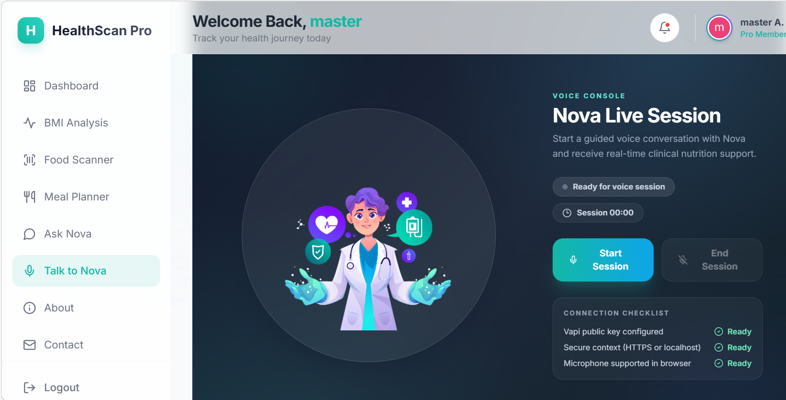

# 🏥 HealthScan Pro

**Your Personal AI-Powered Nutritionist & Health Companion**

HealthScan Pro is a cutting-edge web application designed to revolutionize how you track your nutrition. Combining real-time barcode scanning, deep health analysis, and AI-driven consultations, it's the only tool you need to master your diet and achieve your wellness goals.


---

## 🌟 Key Features

### 1. **Interactive Dashboard**
Get a high-level view of your daily health stats. Track calories, water intake, and macronutrient distribution through beautiful, animated glassmorphic widgets.


### 2. **AI Food Scanner**
Instantly scan product barcodes. We fetch real-time data from global databases (OpenFoodFacts) to provide you with NutriScores, allergen alerts, and detailed nutritional breakdowns, plus Dr. Nova's AI Analysis.


### 3. **Professional Health Analysis**
Beyond just BMI. Get personalized advice based on your BMR, TDEE, and activity levels. Our AI analyzes your data to suggest optimal calorie and macronutrient splits.


### 4. **Weekly Meal Planner**
Organize your nutrition with a vibrant, intuitive planner. Add meals manually or generate AI plans, track calories per meal, and manage your entire week's diet in one place.


### 5. **Ask Nova (AI Nutritionist Doctor)**
Meet Dr. Nova—your 24/7 AI health consultant. Powered by **DeepSeek API**, Nova provides evidence-based medical-grade nutritional advice, remembers your conversation history, and helps you navigate complex health queries as a professional dietitian.


### 6. **Talk to Nova (Voice Agent)**
Launch a live, hands-free voice session with Nova. The **Voice Agent** uses **Vapi** for low-latency voice conversations, session controls, and microphone management to deliver a premium, real-time consultation experience.


---

## 🚀 Tech Stack

### Frontend
- **Framework**: [React 18](https://reactjs.org/) with [Vite](https://vitejs.dev/)
- **Language**: [TypeScript](https://www.typescriptlang.org/)
- **Styling**: [Tailwind CSS](https://tailwindcss.com/) (Glassmorphism, Modern Gradients)
- **Animations**: [Framer Motion](https://www.framer.com/motion/)
- **Icons**: [Lucide React](https://lucide.dev/)
- **Charts**: [Recharts](https://recharts.org/)
- **Auth**: [Clerk](https://clerk.com/)
- **Voice Agent**: [Vapi](https://vapi.ai/)

### Backend & AI
- **Runtime**: [Node.js](https://nodejs.org/) & [Express](https://expressjs.com/)
- **AI Engine**: [DeepSeek API](https://www.deepseek.com/) (OpenAI-compatible)
- **Database**: [MongoDB](https://www.mongodb.com/) (via Mongoose)
- **Barcode Scanning**: [@zxing/browser](https://github.com/zxing-js/browser)
- **Nutrition Data**: [OpenFoodFacts API](https://world.openfoodfacts.org/data)

---

## 🛠️ Getting Started

### Prerequisites
- **Node.js**: v18 or higher
- **Package Manager**: npm or yarn

### 1. Clone the project
```bash
git clone https://github.com/amaanshaikh711/HealthScan-Pro.git
cd HealthScan-Pro
```

### 2. Environment Configuration
Create a `.env.local` file in the `client` directory and add your keys:
```env
VITE_CLERK_PUBLISHABLE_KEY=your_clerk_key
VITE_DEEPSEEK_API_KEY=your_deepseek_key
VITE_DEEPSEEK_BASE_URL=https://api.deepseek.com
VITE_VAPI_PUBLIC_KEY=your_vapi_public_key
```

### 3. Installation & Local Development

#### Install Client Dependencies
```bash
cd client
npm install
npm run dev
```

#### Install Server Dependencies
```bash
cd ../server
npm install
node index.js
```

The application will be running at `http://localhost:5173`.

---

## 🛡️ Medical Disclaimer

The information provided by HealthScan Pro and its AI assistant, Dr. Nova, is for educational and informational purposes only and is not a substitute for professional medical advice, diagnosis, or treatment. Always seek the advice of your physician or other qualified health provider with any questions you may have regarding a medical condition.

---

## 📄 License

Distributed under the MIT License. See `LICENSE` for more information.

---
*Built with ❤️ by Amaan S.*
